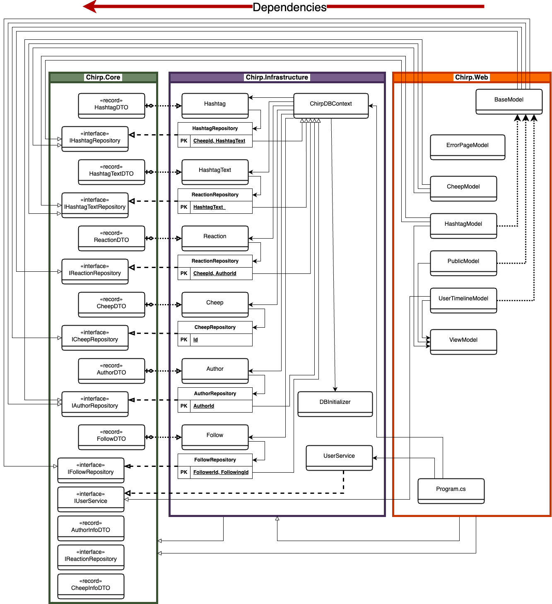
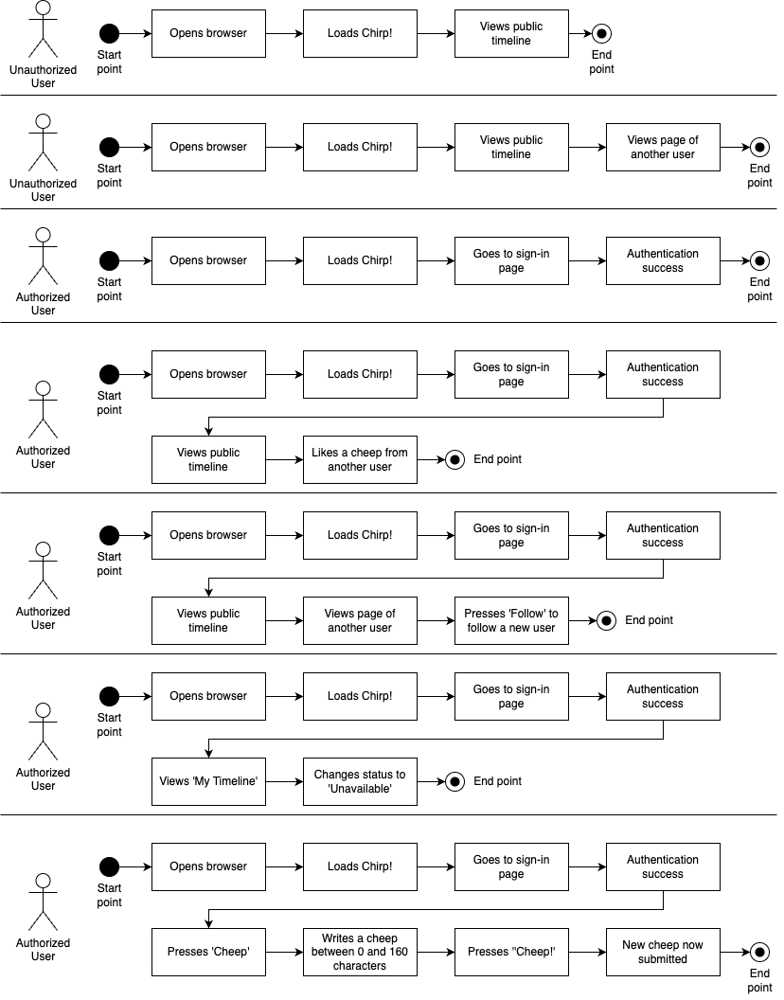
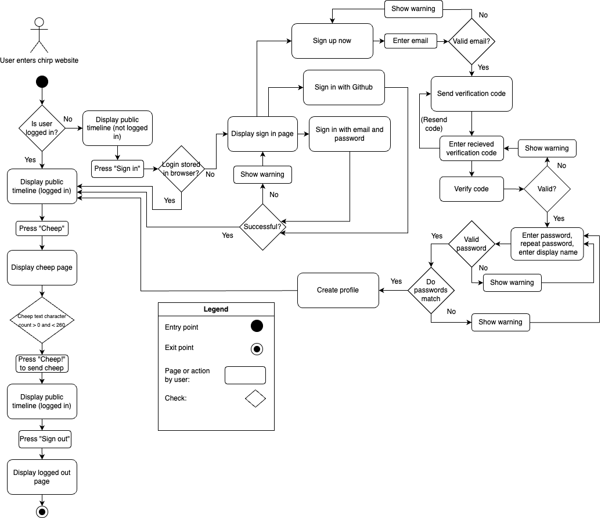
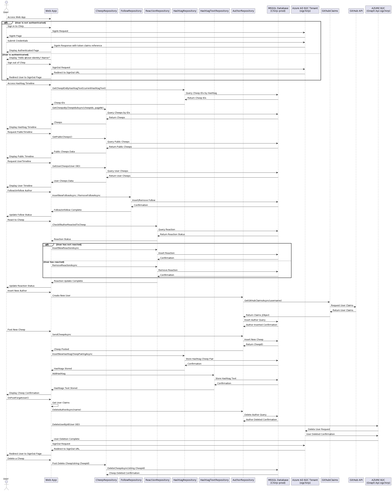
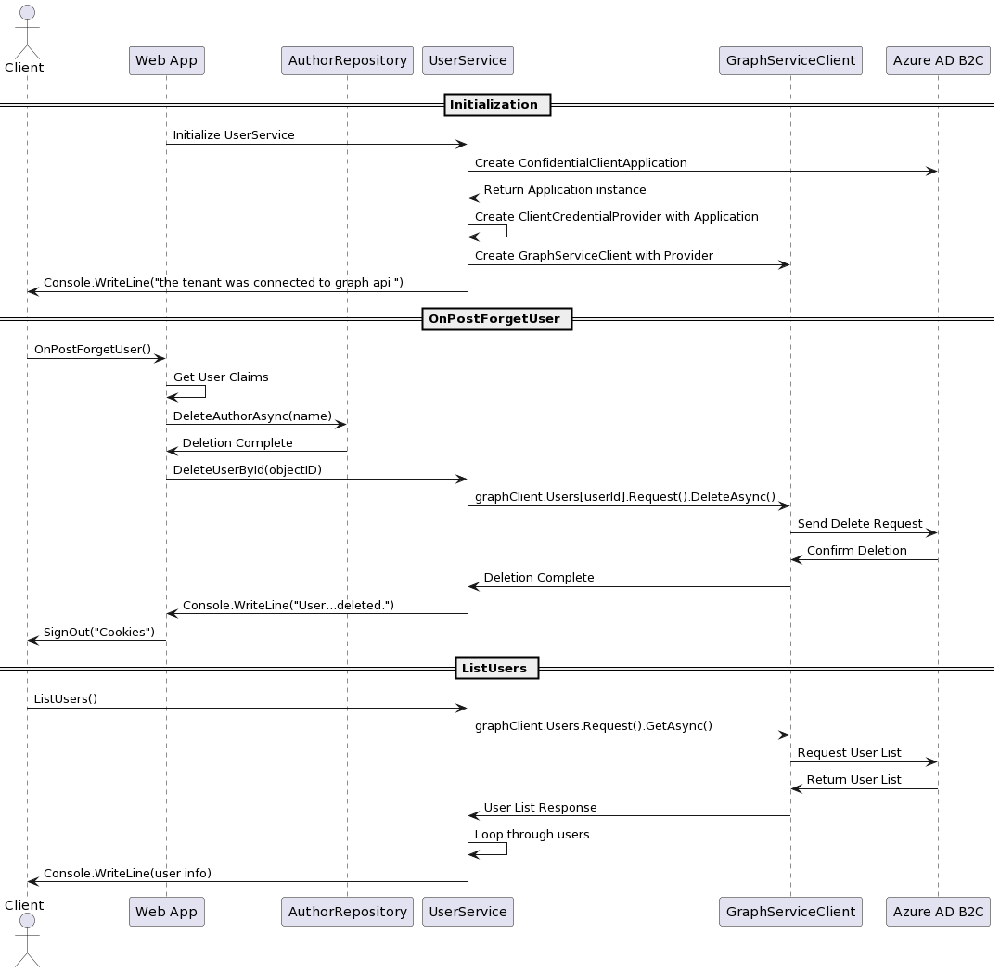
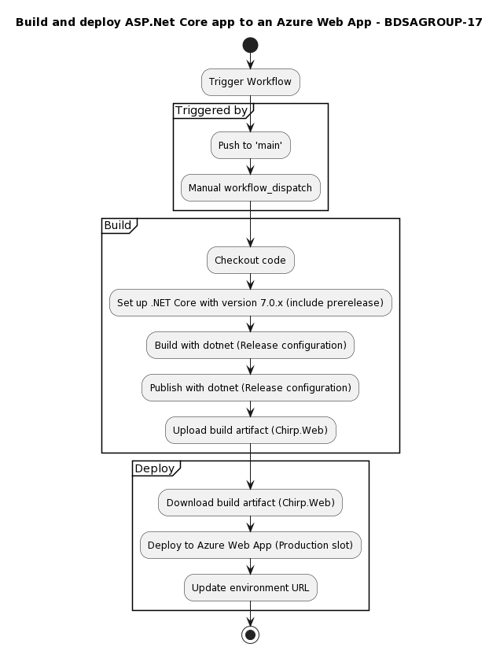
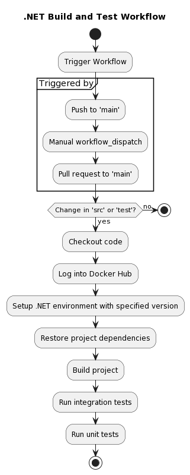
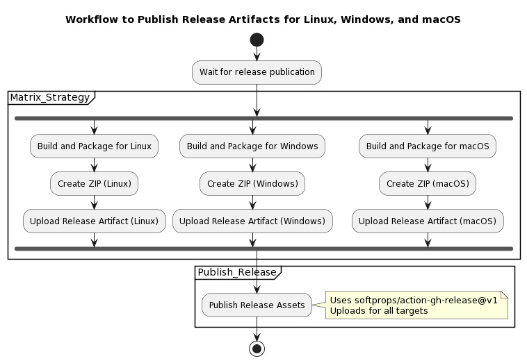
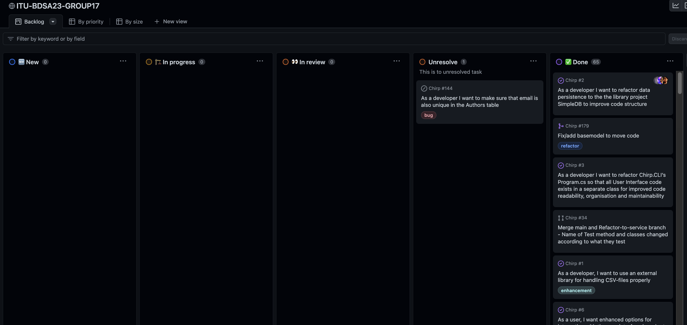
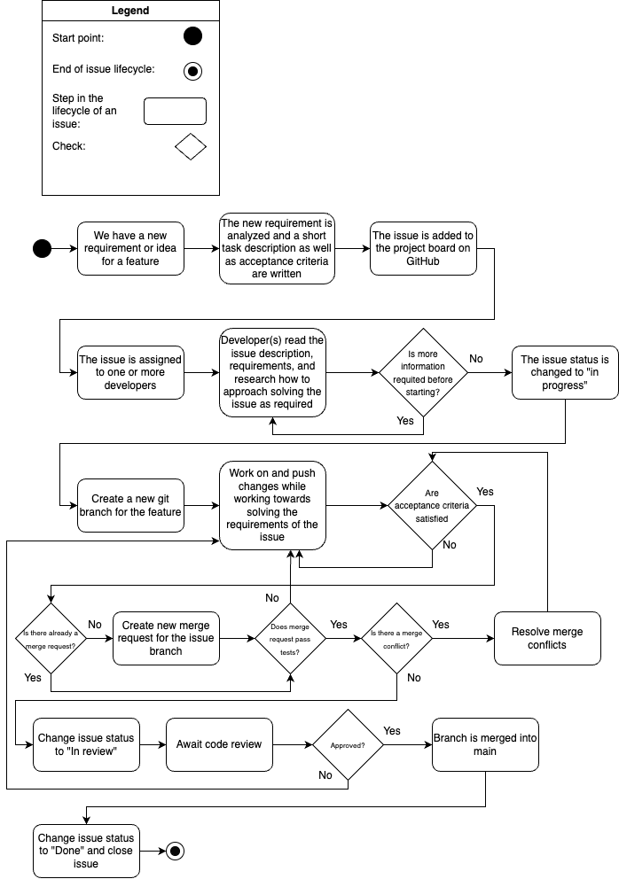

# BDSA GROUP 17 2023

## Course code: BSANDSA1KU

## Date: December 21, 2023

| Name                       | Email        | Date of Birth |
| -------------------------- | ------------ | ------------- |
| Burak Özdemir              | buoe@itu.dk  |               |
| Hanan Choudhary Hadayat    | abha@itu.dk  |               |
| Joshua James Medilo Calba  | jcal@itu.dk  |               |
| Julius Dalsgaard Bertelsen | jube@itu.dk  |               |
| Tan Dang                   | tanda@itu.dk |               |

## Design and architecture

### Domain model

<!--  -->

The domain model reflects the entities and their relationship of the Chirp application, as well as the interfaces of the repositories that allow for accessing and manipulating these different entities and their related data. These entities form the foundation of the business logic of the application.
<br>
<br>
The diagram below shows the domain model of the Chirp application.

<div style="text-align: center; padding: 20px; background-color: white;">
    
</div>

<!-- Provide an illustration of your domain model.
Make sure that it is correct and complete.
In case you are using ASP.NET Identity, make sure to illustrate that accordingly. -->

### Architecture — In the small

The application Chirp has been designed with Onion architecture in mind.

The diagram below shows the organization of the code of the Chirp application, showcasing the relationships and dependencies of different components of the program, highlighting how the code of the program is organised into different layers of the onion architecture design.

At the centre of the onion architecture are the domain entities in Chirp.Core, as seen in the domain model shown above.

Surrounding the Core is first the Chirp.Infrastructure layer. This layer contains the implementations of the repository interfaces, and is responsible for actually handing mechanisms of data storage, access and manipulation connected to the core entities.

The Web layer surrounds these layers. It is responsible for the presentation of the application, handling the user interface and user interactions. The layer interacts with the core and infrastructure layers, using the domain entities and data access mechanisms to allow the user the interact with the business logic and data of the application.

The diagram shows how the Chirp application has been designed with an inward flow of dependencies in accordance with Onion architecture, so that the inner layers remain independent of external dependencies.

Some relationships have been omitted to improve the readability of the diagram.

<div style="text-align: center; padding: 20px; background-color: white;">



</div>

The figure below shows a more simplistic view of the onion architecture structure of the components of the application.


<!-- Illustrate the organization of your code base.
That is, illustrate which layers exist in your (onion) architecture.
Make sure to illustrate which part of your code is residing in which layer. -->

### Architecture of deployed application

The Chirp application is deployed on Microsoft Azure, utilizing Asure services with an Azure SQL database.

The diagram below shows the interaction between the client component with a user interface allowing the user to make requests and the application deployed on Microsoft Azure as the server component.
The diagram also shows the interaction of this deployed application with the Azure SQL Database, as well as signing in through a social account (GitHub).

<!-- Illustrate the architecture of your deployed application.
Remember, you developed a client-server application.
Illustrate the server component and to where it is deployed, illustrate a client component, and show how these communicate with each other. -->

<!-- **OBS**: In case you ran out of credits for hosting an Azure SQL database and you switched back to deploying an application with in-process SQLite database, then do the following: -->

<!-- - Under this section, provide two diagrams, one that shows how _Chirp!_ was deployed with hosted database and one that shows how it is now again with SQLite.
- Under this section, provide a brief description of the reason for switching again to SQLite as database.
- In that description, provide a link to the commit hash in your GitHub repository that points to the latest version of your _Chirp!_ application with hosted database (we look at the entire history of your project, so we see that it was there at some point). -->

<div style="text-align: center; padding: 20px; background-color: white;">


</div>

### User activities

<!-- Illustrate typical scenarios of a user journey through your _Chirp!_ application.
That is, start illustrating the first page that is presented to a non-authorized user, illustrate what a non-authorized user can do with your _Chirp!_ application, and finally illustrate what a user can do after authentication.

Make sure that the illustrations are in line with the actual behavior of your application. -->

A user may follow various paths when using the Chirp application.

The diagram below shows a series of typical user activities through the Chirp application.
The diagram shows what a user may do while remaining unauthorized, and after logging in and becoming authorized.

<div style="text-align: center; padding: 20px; background-color: white;">



</div>
<br/>

Additionally, the diagram below shows a slightly more detailed view of possible scenarios of a user journey through Chirp, in which a user enters the chirp website, logs in, or creates a profile if necessary, sends a cheep, and then logs out.

<div style="text-align: center; padding: 20px; background-color: white;">



</div>

### Sequence of functionality/calls trough _Chirp!_

<!-- With a UML sequence diagram, illustrate the flow of messages and data through your _Chirp!_ application.
Start with an HTTP request that is send by an unauthorized user to the root endpoint of your application and end with the completely rendered web-page that is returned to the user.

Make sure that your illustration is complete.
That is, likely for many of you there will be different kinds of "calls" and responses.
Some HTTP calls and responses, some calls and responses in C# and likely some more.
(Note the previous sentence is vague on purpose. I want that you create a complete illustration.) -->

There is a flow of messages and data through the chirp application, which allow the user to see and interact with a completely rendered web page.

The diagrams below illustrates this flow of messages and data, starting with the sending of an HTTP request by an authorized user to the root endpoint of the application and ending with the completely rendered web-page that is returned to the user.
The diagram shows the different kinds of calls and the responses.



Another diagram, this one shows .....

<div style="text-align: center; padding: 20px; background-color: white;">



</div>

## Process

### Build, test, release, and deployment

<!-- Illustrate with a UML activity diagram how your _Chirp!_ applications are build, tested, released, and deployed.
That is, illustrate the flow of activities in your respective GitHub Actions workflows.

Describe the illustration briefly, i.e., how your application is built, tested, released, and deployed. -->



This workflow is the deploy workflow for azure

1. The User triggers the workflow on `main` branch or manually dispatching the workflow .
2. The GitHub repository then triggers the `build` job on the GitHub Actions Runner dedicated to building the app.
3. The build runner performs the following steps:
   - Checks out the repository.
   - Sets up .NET Core SDK version 7.0.x with prerelease versions included.
   - Builds the ASP.NET Core app from the specified source directory with the Release configuration.
   - Publishes the app to the output directory.
   - Uploads the build artifact (Chirp.Web) to GitHub's artifact storage.
4. Once the build job is complete, the repository triggers the `deploy` job on another GitHub Actions Runner.
5. The deployment runner downloads the artifact from the storage.
6. Finally, deployment runner deploys the downloaded artifact to the specified Azure Web App using the given publish profile.



This workflow is build

1. This workflow is triggered in the same way as the deploy flow, but the build and test flow is also triggered when there is a pull request to `main`
2. The workflow then checks if there was a change to src or test if no then it stops
3. The build runner performs the following steps:
   - Checks out the repository.
   - Then workflow logs into Docker Hub
   - Sets up .NET Core SDK with the given version
   - restores project dependences
   - Builds the project without restoring dependencies again.
   - Runs the Integration tests.
   - Runs the unit tests



This is release workflow

- The workflow is triggered when a release is published.
- The `Matrix_Strategy`
  - For Linux, the workflow builds and packages the application, creates a ZIP file, and uploads the artifact.
  - For Windows, the workflow repeats the same steps but tailored for the Windows target.
  - For macOS, the workflow performs the steps for the macOS target.
- After the artifacts for all three targets are prepared and uploaded, the `Publish_Release` partition publishes the release assets using the `softprops/action-gh-release@v1` action. This step uses the uploaded artifacts for each target as part of the release.
- The process ends after the release assets are published.

### Team work

<!-- Show a screenshot of your project board right before hand-in.
Briefly describe which tasks are still unresolved, i.e., which features are missing from your applications or which functionality is incomplete. -->

Throughout the project we have used GitHub issues to help structure the collaboration on the features of the Chirp application by multiple developers.

Overall we managed to complete all the features we wanted for the application. These include all the features specified by the requirements of the project and some extra features, such as some UI changes, hashtags, and ...

We have one unresolved task in our project board: To make the email unique in the the Authors table, since there was a possibility that an Author could appear twice or more in the table with same name and email but with different id. The reason we did not resolve it is the low priority.

The image below shows the project board just before hand-in, with the remaining unresolved issue.

We were able to complete all the feature we want for our application. There were of course many feature we can implement, comment a cheep as well as share a cheep to name a few, but those were never in our original plan since we only focus on those feature we could make.


There are of course many more features we could have implemented given time. Some ideas, which were discussed during development but not prioritized include the ability to comment on a cheep and sharing a cheep to name a few.

<!-- Briefly describe and illustrate the flow of activities that happen from the new creation of an issue (task description), over development, etc. until a feature is finally merged into the `main` branch of your repository. -->

When deciding to prioritize a new feature or requirement, we create an issue featuring a description of the task with a list of acceptance criteria. This issue is then assigned to one or more developers, who work on it in a designated branch until the requirements are fulfilled, a merge request is created and the feature branch is merged into the main branch of the project repository.

The diagram below shows the lifecycle of a GitHub issue from it's creating until it is closed and resolved.

<div style="text-align: center; padding: 20px; background-color: white;">



</div>

In practice, this process was not always strictly adhered to, but the diagram gives a general and idealized depiction of the process, which was mostly followed. Even though this process was not always strictly adhered to, the work with GitHub issues but still proved a very useful tool during development.

### How to make _Chirp!_ work locally

<!-- There has to be some documentation on how to come from cloning your project to a running system.
That is, Rasmus or Helge have to know precisely what to do in which order.
Likely, it is best to describe how we clone your project, which commands we have to execute, and what we are supposed to see then. -->

### Run locally

In order to run the application locally, you can either <b>1. clone this repository</b>, or <b>2. run the release version</b>.

#### Cloned repository</h4>

In order to run the application locally by cloning the repository, please do as follows:

Clone the repository using this git command:

```
git clone https://github.com/ITU-BDSA23-GROUP17/Chirp.git
```

Change directory into

```
cd "src/Chirp.Web"
```

Inside the directory, run <b>one</b> of the following commands: </li>

```
dotnet watch --clientsecret [your-secret]
```

```
dotnet run --clientsecret [your-secret]
```

You should now have access to a localhost with a specific port, in which this web-app can be accessed

#### Releases

In order to run the release versions, please do as follows:

- On the main page of this repository, click on the <b>Releases</b>-section</li>
  There will be a few assets available (including source code), but only one of the following three will be relevant for us:</li>

  - Chirp-win-x64.zip</i>, for Windows users</li>
  - Chirp-osx-x64.zip</i>, for Mac users</li>
  - Chirp-linux-x64.zip</i>, for Linux users</li> <br>

  Please install and unzip one of the three folders, depending on your operating system</li>
  Now, there should be the following application available in the extracted folder:</li><br>

       - Chirp.Web.exe</i>, for Windows users</li>
       - Chirp.Web</i>, for Mac and Linux users</li> <br>

  Now, you have an runnable (as described in step 4). Depending on your operating system, you can run the web-app as follows: </li>

  Run the following commands:
  `   dotnet dev-certs https -t`

        ```
        ./Chirp.Web --urls="https://localhost:7102;http://localhost:5273" --clientsecret [your-secret]
        ```

  Upon running the application, a terminal will pop up, indicating in which port (in the localhost) the web-app is up and running

### How to run test suite locally

<!--
List all necessary steps that Rasmus or Helge have to perform to execute your test suites.
Here, you can assume that we already cloned your repository in the step above.

Briefly describe what kinds of tests you have in your test suites and what they are testing. -->

In the root folder run this command to test all the test

```bash
dotnet test
```

Make sure you have docker running in your machine

The following test have been implemented

#### Unit test

The unit tests are designed to test each individual component of our application by itself.

We have designed a series of unit tests to verify that our DTOs correctly encapsulate data. These tests confirm that each DTO retains and accurately represents the data passed to its constructor.

#### DTO Unit Tests

- `AuthorDTO_ShouldHoldProvidedValues`: Checks if the AuthorDTO object correctly assigns and retains the values provided.
- `CheepDTO_ShouldHoldProvidedValues`: Checks if the CheepDTO object correctly assigns and retains the values provided.
- `ReactionDTO_ShouldHoldProvidedValues`: Checks if the ReactionDTO object correctly assigns and retains the values provided.
- `HashtagDTO_ShouldHoldProvidedValues`: Checks if the HashtagDTO object correctly assigns and retains the values provided.

To run only the unit tests, use the following command in the root folder of the project:

```bash
dotnet test --filter Category=Unit
```

##### Integration test

The integration tests are designed to test how different parts of the application interacts with eachother. These tests involves instances of the database containers and checks if the application does the CRUD operations as expected.

##### AuthorRepositoryTest

- `GetStatusNotNull`: Checks that the AuthorRepository is able to receive a non-null status (string).
- `GetStatusIsValid`: Checks that the AuthorRepository is able to receive a valid status, i.e., a status which equals ONLINE/OFFLINE/UNAVAILABLE.
- `SetUserStatusOnline`: Checks that the AuthorRepository is able to change the status of a user to ONLINE.
- `SetUserStatusOffline`: Checks that the AuthorRepository is able to change the status of a user to OFFLINE.
- `SetUserStatusUnavailable`: Checks that the AuthorRepository is able to change the status of a user to UNAVAILABLE.

##### CheepRepositoryTest

- `InsertCheepAsyncAddsCheepToDatabase`: Checks that cheeps are properly inserted into the database and are retrievable.
- `CheepOverLimitNotInserted`: Checks that a cheep over limit (i.e., over 160 characters) is NOT inserted into the database.
- `CheepUnderLimitNotInserted`: Checks that empty cheeps (i.e., cheeps with 0 characters in length) is NOT inserted into the database.

##### FollowRepositoryTest

- `GetFollowerIDsByAuthorIDAsync_ReturnsCorrectFollowerIDs`: Checks if the correct follower IDs are returned for a given author ID.
- `GetFollowingIDsByAuthorIDAsync_ReturnsCorrectFollowingIDs`: Checks if the correct following IDs are returned for a given follower ID.
- `InsertNewFollowAsync_InsertsFollowSuccessfully`: Checks that a new follow relationship is successfully inserted into the database.
- `RemoveFollowAsync_RemovesFollowSuccessfully`: Checks that a follow relationship is removed as expected.
- `GetFollowerCountByAuthorIDAsync_ReturnsCorrectCount`: Checks if the correct follower count is returned for an author.
- `GetFollowingCountByAuthorIDAsync_ReturnsCorrectCount`: Checks if the correct count of followings is returned for an author.

##### HashtagRepositoryTest

- `GetCheepIDsByHashtagText_GetsCheepIDsTiedToHashtag`: Checks if cheep ID's tied to a hashtag gets retrieved
- `InsertNewCheepHashtagPairingAsync_InsertsANewHashtagWithCorrectCheepIdAndHashtagText`: Checks if a new hashtag-cheep pairing is correctly inserted.
- `GetPopulalarHashtags_Returns10PopularHashtags`: Checks if the method returns the top 10 popular hashtags based on frequency.

##### HashtagTextRepositoryTest

- `AddHashtag_AddsHashtagToDatabase`: Checks if a new hashtag is added to the database.
- `AddHashtag_WillNotAddTheSameHashtagMoreThanOnce`: Checks that duplicate hashtags are not added to the database.
- `RemoveHashtag_RemovedSpecifiedHashtagTextIfItExist`: Checks if the specified hashtag text is removed from the database.

Make sure Docker is running as the tests rely on `Testcontainers.MsSql` to create a containerized MS SQL Server instance.

To run only the integration tests, use the following command in the root folder of the project:

```bash
dotnet test --filter Category=Integration
```

Note: As you may notice in our test folder we have more integration tests than unit tests. The reason is that unit test which is testing in the `Chirp.Core` package have only a few methods compared to the integration test, which is testing in the `Chirp.Infrastructure` package. Normally you have more unit test than integration test.

#### End to end test

The playwright can be going into the folder in which the test is saved:

```
cd test\Chirp.Web.Test\Playwright.Test\PlaywrightTests
```

And then run the build command

```
dotnet build
```

After this you need to install the browser:

```
pwsh bin/Debug/net7.0/playwright.ps1 install
```

If you are on Linux or do not have Powershell you can use https://nodejs.org/en

Refer to the given link for installation guide https://docs.npmjs.com/downloading-and-installing-node-js-and-npm

Then run

```
npx playwright install --with-deps
```

Then in the project you can run:

```
dotnet test
```

Which should start the test

## Ethics

### License

<!-- State which software license you chose for your application. -->

We chose to use the MIT license for our Chirp application, since it allows other developers to distribute, use and copy our software without imposing significant restrictions.

### LLMs, ChatGPT, CoPilot, and others

<!-- State which LLM(s) were used during development of your project.
In case you were not using any, just state so.
In case you were using an LLM to support your development, briefly describe when and how it was applied.
Reflect in writing to which degree the responses of the LLM were helpful.
Discuss briefly if application of LLMs sped up your development or if the contrary was the case. -->

We have used LLMs in two ways: For aid in writing code and for aid in understanding the overall concepts of different frameworks, architectures and concepts. In both cases, this came with both advantages and disadvantages.

When using LLMs (Primarily ChatGPT) for gaining a basic understanding of for instance Entity Framework Core, Docker or Onion architecture, the ability to ask direct questions can be a powerful tool in gaining familiarity with these concepts. On the other hand, LLMs are not always a reliable source of information, meaning that the answers provided by ChatGPT and the knowledge gained had to be approached with a level of scepticism, which was at times more frustrating than helpful. Thus, using LLMs in this way did not mean, that we did not also need to seek out more reliable sources of information and documentation.
It is also possible that using LLMs in this way at all leads to a more superficial understanding of the core concepts at play, as any question that arises may be quickly answered by the LLM, without the need to seriously engage with ones own confusions or lack of understanding of the area.

The use of LLMs in generating or helping with the writing of code has also been both helpful and brought certain disadvantages. Most of the time the code that was generated by ChatGPT did not work according to what we wanted, and sometimes the work with debugging code which relied on help from LLMs ended up being more work than it was to just research and properly understand the problem ourselves. ChatGPT was mostly for explaining errors or explaining the code, and did prove helpful in the debugging process in this regard.
We have also used GitHub co-pilot for error handling for our code, but it was quite minimal use. It has the feature to autocomplete our code when we write, but frequently the code it suggest is in no use, the only time it was been effective is when we need to write something that was repeating or very predictable, e.g. when we write insert methods in to our database in `DbInitializer.cs`.
co-pilot also was helpful when writing tests, although we made a point out of not relying too much on it in order to make sure that we fully understood the tests and ensured that they properly tested what needed testing.

In conclusion the use of LLMs has been a useful tool to help with simple repetitive tasks or explaining, analyzing and understanding errors in the code and less helpful in understanding core concepts and ideas, and solving and aiding in complex complex tasks. Overall it is just another addition for a developers toolbox.
